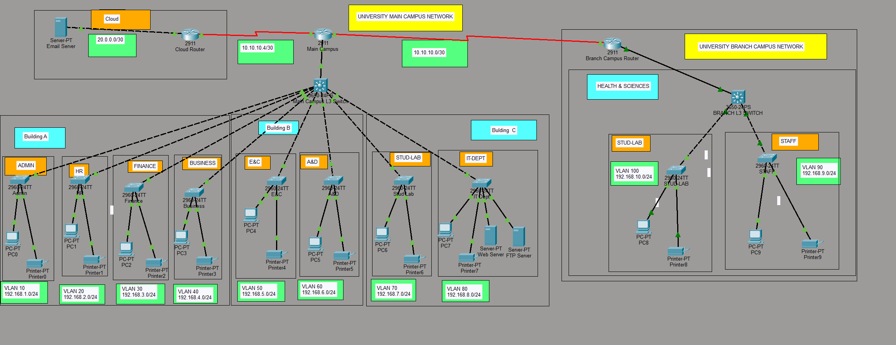
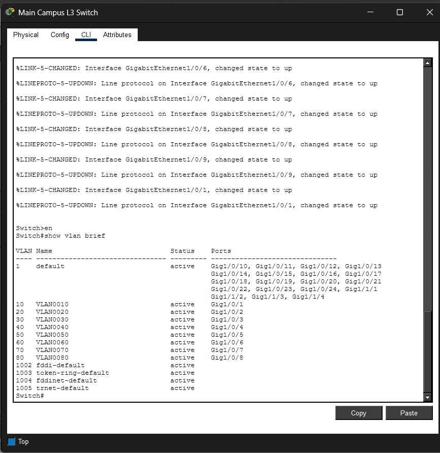
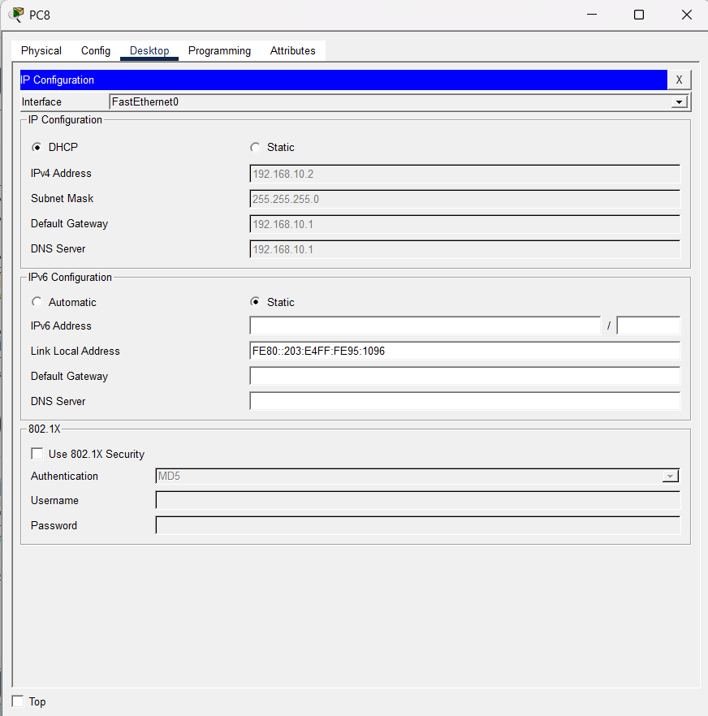
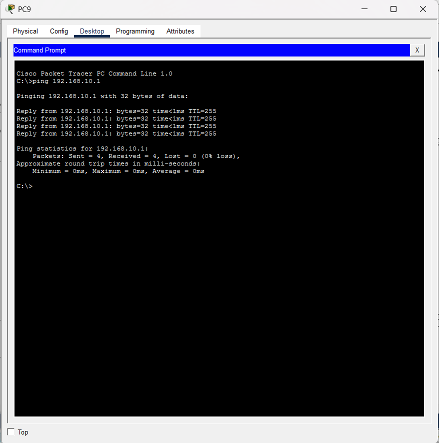
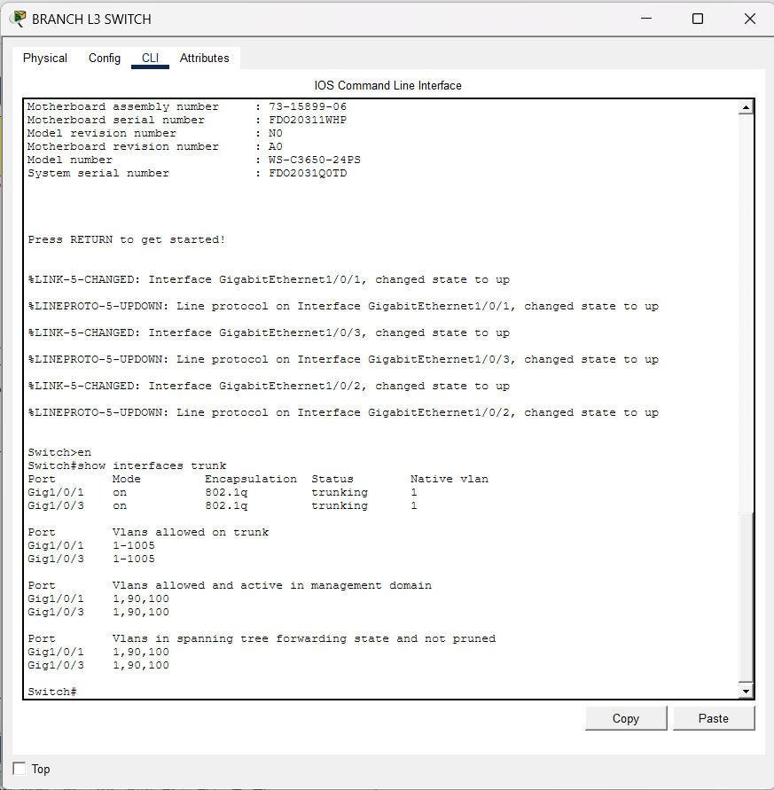

# University Campus Network Design

## 📖 Overview

This project demonstrates the design and implementation of a University Campus Network using Cisco Packet Tracer. The network is divided into multiple VLANs representing various university departments. DHCP is configured for automatic IP address assignment, and Router-on-a-Stick architecture is used to enable communication between different VLANs.

The network includes a Main Campus and a Branch Campus connected through WAN links, simulating a real-world university networking environment.

---
## 🛠 Tools Used

- Cisco Packet Tracer
- Cisco 2911 Routers
- Cisco 3650 Layer 3 Switches
- Cisco 2960 Layer 2 Switches

---
## 🎯 Project Objectives

- Design a scalable university campus network.
- Implement VLAN-based network segmentation.
- Configure DHCP services for dynamic IP allocation.
- Enable inter-VLAN communication.
- Configure trunk links between switches.
- Implement Router-on-a-Stick architecture.
- Simulate a multi-campus university network.

---

## 🛠️ Technologies Used

- Cisco Packet Tracer
- Cisco 2911 Routers
- Cisco Catalyst 3650 Layer 3 Switches
- Cisco Catalyst 2960 Access Switches
- VLANs
- DHCP
- Router-on-a-Stick
- 802.1Q Trunking
- Spanning Tree Protocol (STP)
- WAN Connectivity

---

## 🏢 Network Topology

The network consists of:

### Main Campus

| VLAN ID | Department | Network Address |
|----------|------------|----------------|
| 10 | Administration | 192.168.1.0/24 |
| 20 | Human Resources (HR) | 192.168.2.0/24 |
| 30 | Finance | 192.168.3.0/24 |
| 40 | Business | 192.168.4.0/24 |
| 50 | Engineering & Computing | 192.168.5.0/24 |
| 60 | Arts & Design | 192.168.6.0/24 |
| 70 | Student Lab | 192.168.7.0/24 |
| 80 | IT Department | 192.168.8.0/24 |

### Branch Campus

| VLAN ID | Department | Network Address |
|----------|------------|----------------|
| 90 | Staff | 192.168.9.0/24 |
| 100 | Student Lab | 192.168.10.0/24 |

---

## ⚙️ Features Implemented

### VLAN Segmentation
- Configured VLANs 10–100
- Department-wise network isolation
- Improved security and network management

### DHCP Configuration
- Automatic IP address assignment
- Dynamic gateway and DNS allocation
- Simplified network administration

### Inter-VLAN Routing
- Router-on-a-Stick implementation
- Router subinterfaces configured for VLAN communication
- Communication between all departments

### Trunk Configuration
- IEEE 802.1Q trunking
- Multiple VLAN traffic carried over single links
- Trunk links between Layer 3 and access switches

### Layer 3 Switching
- Centralized VLAN management
- Efficient traffic forwarding

### WAN Connectivity
- Main Campus connected to Branch Campus
- Cloud connectivity simulation

### Spanning Tree Protocol (STP)
- Loop prevention
- Stable switching environment

---

## 🌐 Devices Used

### Routers
- Cisco 2911 Main Campus Router
- Cisco 2911 Branch Campus Router
- Cisco 2911 Cloud Router

### Switches
- Cisco Catalyst 3650 Layer 3 Switches
- Cisco Catalyst 2960 Access Switches

### End Devices
- PCs
- Printers
- Web Server
- FTP Server
- Email Server

---

## 🧪 Verification and Testing

The following tests were successfully completed:

- VLAN Verification
- Trunk Verification
- DHCP Address Allocation
- Inter-VLAN Routing Verification
- Gateway Reachability Testing
- End-to-End Connectivity Testing
- Branch Campus Connectivity Testing

---

## 📂 Project Files

- `UniversityCampusDesign.pkt` – Cisco Packet Tracer project file
- `topology.png` – Complete network topology
- `vlan-config.png` – VLAN configuration verification
- `dhcp-success.png` – DHCP address assignment verification
- `ping-test.png` – Successful connectivity testing
- `trunk-config.png` – Trunk configuration verification

---

## 📸 Screenshots

### Network Topology

### VLAN Configuration

### DHCP Configuration

### Inter-VLAN Connectivity Test

### Trunk Configuration

---

## 🚀 How to Run the Project

1. Download the repository files.
2. Open `UniversityCampusDesign.pkt` using Cisco Packet Tracer.
3. Switch to Real-Time Mode or Simulation Mode.
4. Verify VLAN and DHCP configurations.
5. Test connectivity using ping commands.
6. Observe communication between VLANs and campuses.

---

## 📚 Skills Demonstrated

- VLAN Configuration
- DHCP Configuration
- Router-on-a-Stick
- Inter-VLAN Routing
- 802.1Q Trunking
- Layer 3 Switching
- WAN Configuration
- Network Troubleshooting
- Cisco Device Configuration
- Campus Network Design

---

## 👨‍💻 Author

**Rajat Panwar**

GitHub Repository:
https://github.com/rajatpanwar09/University-Campus-Network

---

## 📌 Project Summary

A comprehensive University Campus Network designed using Cisco Packet Tracer featuring VLAN segmentation, DHCP services, inter-VLAN routing, Layer 3 switching, trunking, WAN connectivity, and multi-campus communication. The project simulates a realistic enterprise-level university network infrastructure.
